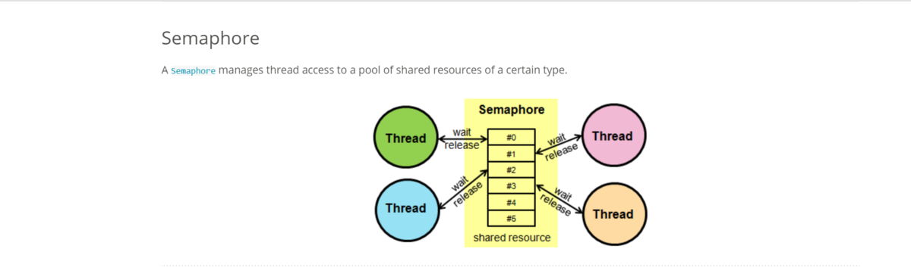
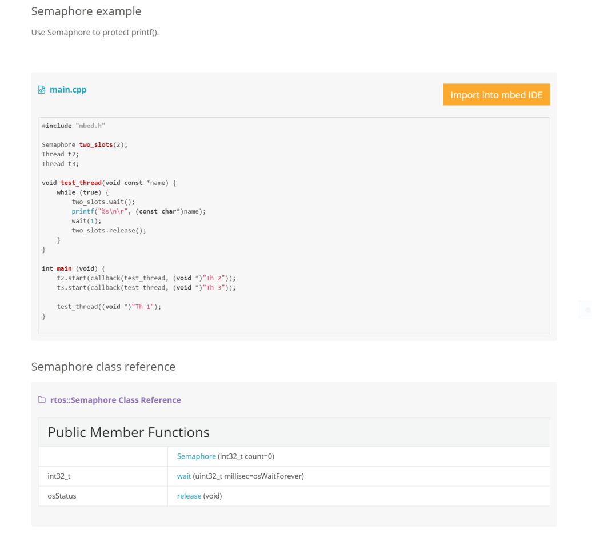

#Semaphore

#Tutorials
1. [Thread safety](https://docs.mbed.com/docs/mbed-os-handbook/en/latest/concepts/thread_safety/) Learn about the mbed OS RTOS and thread safety mechanism and how to port them to a new target.
1. [Memory model](https://docs.mbed.com/docs/mbed-os-handbook/en/latest/concepts/memory_model/) Learn a basic overview of the memory model.
